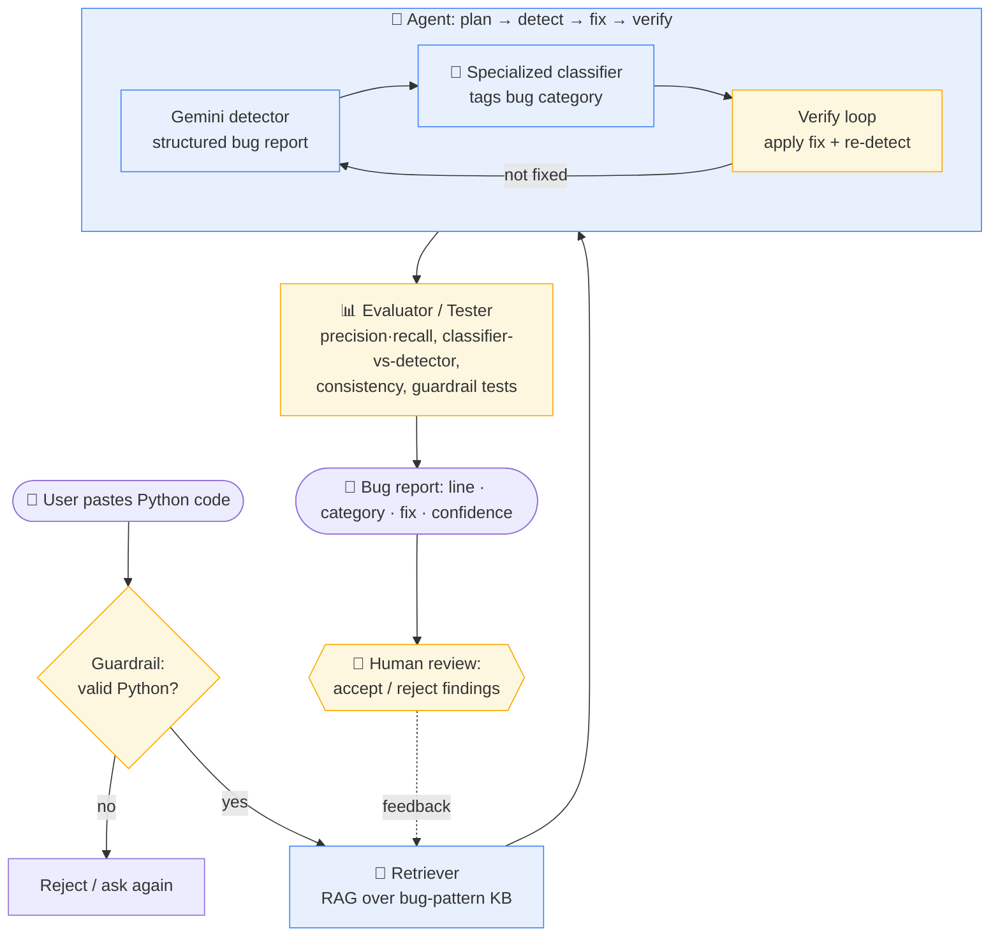

# System Architecture — Glitch Investigator AI

**How to read it:** input flows left-to-right through a guardrail, retrieval, and an agentic detect→classify→verify loop; the **checker components** (amber) are where testing and humans validate the AI — the guardrail screens input, the self-verify loop re-runs the detector on the fixed code, the evaluator measures reliability, and a human reviews the final findings and feeds corrections back.