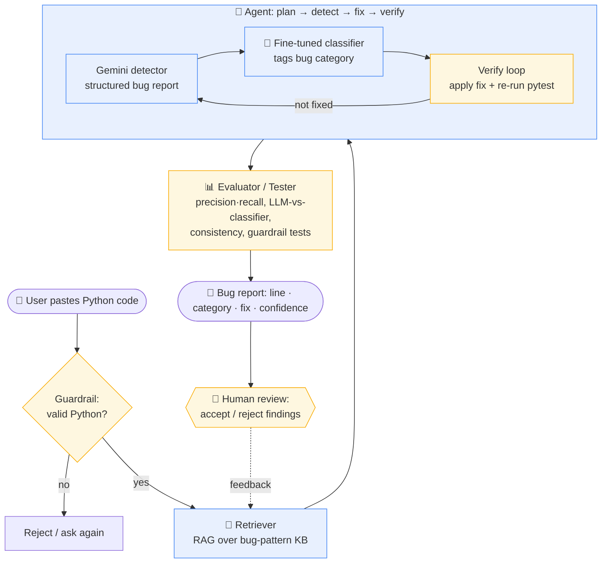

# AI Interactions Log

## 🗺️ System Architecture — Glitch Investigator AI



**How to read it:** input flows left-to-right through a guardrail, retrieval, and an agentic detect→classify→verify loop; the **checker components** (amber) are where testing and humans validate the AI — the guardrail screens input, the self-verify loop re-runs `pytest`, the evaluator measures reliability, and a human reviews the final findings and feeds corrections back.

---

> **Stretch features only.** Only fill in the sections that apply to stretch features you attempted. If you did not attempt a stretch feature, leave its section blank or delete it. This file is not required for the core project.

---

## Agent Workflow (SF8)

> Document your experience using an AI agent (e.g., Cursor Agent, Claude, Copilot) to make multi-step changes autonomously.

**What task did you give the agent?**

<!-- Describe the goal you asked the agent to accomplish -->

**What did the agent do?**

<!-- List the steps the agent took (files edited, commands run, etc.) -->

**What did you have to verify or fix manually?**

<!-- Describe anything the agent got wrong or that required human review -->

---

## Test Generation (SF7)

> Document how you used AI to help generate or improve tests.

| Edge Case | Prompt Used | AI-Suggested Test | Did It Pass? | Your Reasoning |
|-----------|-------------|-------------------|--------------|----------------|
| | | | | |
| | | | | |
| | | | | |

---

## Linting & Style (SF9)

> Document your use of AI for linting or code style improvements.

**Prompt used:**

```
<!-- Paste the prompt you gave the AI -->
```

**Linting output before:**

```
<!-- Paste relevant linter warnings/errors -->
```

**Changes applied:**

<!-- Describe what you changed based on the AI's suggestions -->

---

## Model Comparison (SF11)

> Compare two AI models on the same task.

**Task given to both models:**

<!-- Describe what you asked each model to do -->

| | Model A | Model B |
|-|---------|---------|
| **Model name** | | |
| **Response summary** | | |
| **More Pythonic?** | | |
| **Clearer explanation?** | | |

**Which did you prefer and why?**

<!-- Your conclusion -->
